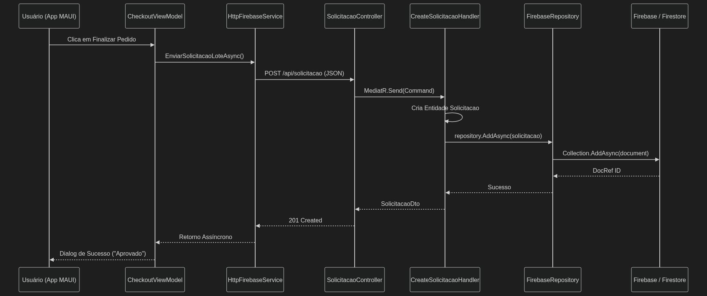

# 🏗️ Architecture Design Document: Fluxo de Solicitações

## 📌 1. Visão Arquitetural (Executive Summary)
Este documento descreve o design técnico e o fluxo sistêmico da criação de pedidos de materiais. A arquitetura foi desenhada sob os princípios do **Domain-Driven Design (DDD)** e **Clean Architecture**, garantindo altíssimo nível de isolamento entre o client-side (Frontend Mobile) e as abstrações de persistência no backend.

---

## 🧩 2. Topologia das Camadas (Layered Design)

O fluxo atravessa 4 anéis concêntricos de responsabilidade, do mais externo (I/O) ao mais interno (Domínio rico):

| Camada | Componente Principal | Responsabilidade | Design Pattern Associado |
| :--- | :--- | :--- | :--- |
| **Presentation (Client)** | `Almoxarifado.App` (MAUI) | Consumo do formulário via ViewModels e controle de estado reativo. | MVVM, Dependency Injection |
| **API Gateway** | `Almoxarifado.API` (ASP.NET) | Bind de rotas REST, serialização JSON e delegação de payload. | RESTful Controller |
| **Application (Use Cases)**| `Almoxarifado.Application` | Processamento do negócio através de *Mensageria in-memory*. | CQRS (MediatR), ThrowHelpers |
| **Infrastructure (Data)** | `Almoxarifado.Infrastructure` | I/O exclusivo com a nuvem, abstraindo os provedores externos. | Repository Pattern O(1) |

---

## 🔄 3. Ciclo de Vida da Transação (Step-by-Step)

A esteira de processamento garante a integridade dos dados desde o toque na tela até o registro na nuvem:

1. **Trigger de UI:** O Ator dispara o comando de finalização através do `CheckoutViewModel`.
2. **Network Layer:** O `HttpFirebaseService` anexa o *Bearer Token* e transmite o payload de forma assíncrona para a API.
3. **CQRS Dispatch:** O `SolicitacaoController` intercepta a requisição e emite o `CreateSolicitacaoCommand` no barramento do MediatR.
4. **Validação e Domínio:** O `CreateSolicitacaoHandler` orquestra as regras. Utiliza blindagem Sênior (rejeição implícita de nulos) e materializa a Entidade raiz `Solicitacao`.
5. **Persistência Acoplada:** O repositório genérico `IWriteOnlyRepository<T>` invoca a `FirebaseEngine<T>`, que comuta a Entidade em mapa JSON de forma transparente através de Reflexão.
6. **Cloud Commit:** O Firestore processa a inserção atômica no banco NoSQL.
7. **Callback:** O *DocRef ID* gerado pela nuvem sobe a esteira devolvendo o status `201 Created` e sinalizando o encerramento no App Móvel.

### Diagrama de Sequência Estrutural

## 🛡️ 4. Resiliência e Segurança (Non-Functional Requirements)

- **Fail-Fast Principles:** Toda injeção de dependência e validação de parâmetros utiliza *Guard Clauses* modernas do C# (`ArgumentNullException.ThrowIfNull`), abortando comportamentos inesperados em tempo de execução sem corromper memória.
- **Tratamento de Exceções Desacoplado:** O App Mobile encapsula falhas de rede em blocos de proteção isolados (`try/catch` otimizados na ViewModel), garantindo que vazamentos de StackTrace nunca atinjam o end-user.
- **Isolamento de Base de Dados (Agnostic Data):** A aplicação desconhece o Firebase. Ela dialoga exclusivamente com a interface genérica `IRepository`, permitindo a substituição do banco subjacente (ex: SQL Server, MongoDB) com **Zero-Downtime** na camada de Aplicação.
- **Isolamento de Assets (Binário vs Docs):** Imagens e artefatos visuais de documentação arquitetural (como este diagrama de fluxo) são estritamente mantidos na pasta `docs/assets/` na raiz do repositório. Isso impede o vazamento de arquivos de infraestrutura e documentação para dentro do binário final do aplicativo (.apk/.ipa), preservando a pasta nativa `Almoxarifado.App/Resources/Images/` exclusivamente para ativos consumidos diretamente pela UI móvel.

---

## 🧪 5. Protocolo de Validação (Homologação)

Para auditar o fluxo no ambiente de desenvolvimento:
1. Intercepte o token JWT na autenticação via App MAUI.
2. Inicie uma transação injetando um artefato no carrinho e prossiga para o checkout.
3. Observe o log de Network (HTTP 201).
4. Verifique fisicamente o nó na estrutura NoSQL do Firebase Console (`collection: solicitacao`) para atestar que o estado transitório foi consolidado para `Pendente`.
